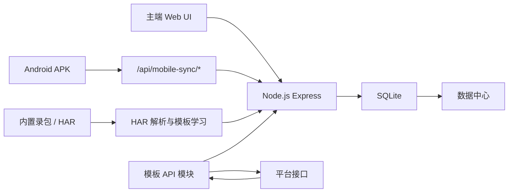

# 系统架构

## 目标

系统用于采集并统一展示场站数据：

- 充电平台：场站名称、地址、快充/慢充/超充数量、空闲/总数、价格、分时价格。
- 团油：油站名称、地址、92/95/98/柴油价格；没有值或价格为 0 的油号不展示。
- 所有链路统一入库、统一去重、统一展示和导出。

## 三条采集链路

### 1. 页面自动化识别

原“前端读取”。用于读取微信小程序页面已经展示出来的数据。

```text
手机/微信小程序 -> 自动下滑 -> OCR 或辅助功能文本读取 -> 手机端解析 -> /api/mobile-sync/* -> SQLite
```

主要组件：

- Android APK：`mobile/android`
- OCR 服务：`CaptureOcrService.java`
- 无截屏文本读取：`AccessibilityTextCollectService.java`
- 自动下滑：`AutoScrollAccessibilityService.java`
- 本地解析：`DidiLocalStationParser.java`
- 后端入口：`POST /api/mobile-sync/ocr`、`POST /api/mobile-sync/stations`

适用场景：

- 接口加密或抓包不可读。
- 页面可见字段已经足够。
- 需要通过详情页补全名称、地址、价格或枪数。

### 2. 后台自动化识别

原“自动化 + Charles”升级为“自动化 + 内置抓包中心”。程序负责自动点击、下滑、切城市；后端录包服务负责代理监听、HAR 产出和模板学习输入，Charles 只保留为兜底对照工具。

```text
主端会话 -> 小程序自动化 -> 内置录包服务 -> HAR 导入 -> HAR 解析/模板学习 -> SQLite
```

主要组件：

- 自动化控制：`backend/automation/*`
- 会话接口：`/api/smart-collect/*`
- HAR 解析：`backend/parser/charles-parser.js`
- 模板学习：`backend/crawler/smart-crawler.js`
- HAR 接口：`/api/parse-har-upload`、`/api/crawler/learn-upload`
- 录包服务：`/api/capture-recorder/status|start|stop`

适用场景：

- 流量响应是明文 JSON。
- 页面识别不稳定，但抓包可解析。
- 需要把 HAR 沉淀成流量自动化识别模板。

### 3. 流量自动化识别

原“模板 API”。直接使用 HAR 学习或人工维护的模板 API 采集。

```text
城市/地标定位 -> 网格坐标 -> OutboundClient -> 模板 API 请求 -> 平台解析 -> SQLite
```

主要组件：

- 地标定位：`/api/geocode/search`
- 网格生成：`/api/crawler/generate-grid`
- 异步任务：`/api/crawler/crawl-platforms-with-coordinates/start`
- 模板执行：`backend/crawler/smart-crawler.js`
- 模板库存：`backend/models/api-template.js`
- 统一请求客户端：`backend/services/outbound-client.js`
- 代理池：仅场站/油站模板 API 使用城市代理、省级代理、代理商代理和 47 默认代理
- 请求证据：`data/outbound-evidence/*.jsonl`

适用场景：

- 有稳定列表/详情模板。
- 需要多城市、多地标、批量请求。
- 需要城市代理出口规避异地查询风控。

## 数据流



## 统一数据模型

核心表：

- `stations`：场站快照。相同场站在不同时间采集到价格/枪数时应作为新快照保留。
- `price_schedules`：分时价格结构化数据。
- `api_templates`：模板 API 库。
- `crawl_runs` / `crawl_run_logs`：采集运行记录和日志。
- `collection_tasks`：定时任务。

关键字段原则：

- 价格和枪数保留平台原始结构到 `raw_data`，同时抽取统一字段供主端展示。
- 分时价格不能只依赖 `raw_data`，需要进入 `price_schedules`。
- 城市统计以 `raw_data.mobileSync.meta.city` 为准，不能只按名称或地址包含城市文字判断。
